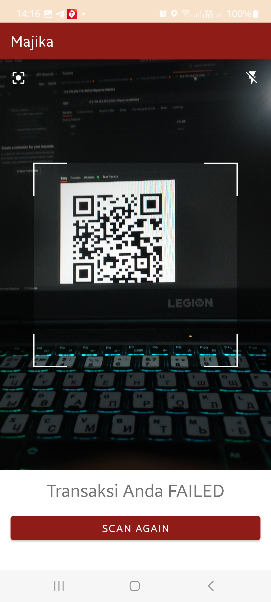

# IF3210-2023-Android-API

## Anggota

1. 13520086 - Fawwaz Anugrah WD
2. 13520098 - Andika Naufal Hilmy
3. 13520122 - Alifia Rahmah

## Deskripsi aplikasi

Majika adalah aplikasi simulasi pemesanan makanan dan minuman secara daring berbasis Android.
Aplikasi ini dibuat menggunakan Kotlin dan dibuat untuk memenuhi tugas IF3210 Pengembangan Aplikasi pada Platform Khusus.

## Library yang digunakan

1. Retrofit
2. AndroidX
3. Coroutines
4. Room
5. Google Maps API
6. QR Code
7. CameraX
8. Code Scanner

## Screenshot aplikasi

### Kamera

### Cabang

### Menu

### Keranjang

### QR Code Scanner

## Pembagian kerja anggota kelompok

1. 13520086 - Fawwaz Anugrah WD
    - Camera
    - Twibbon
    - Menu
    - Implementasi API Retrofit
2. 13520098 - Andika Naufal Hilmy
   - QR
3. 13520122 - Alifia Rahmah
   - Navbar & Bottom Navigation
   - Cabang
   - Keranjang

## Jumlah jam persiapan dan pengerjaan untuk masing-masing anggota

1. 13520086 - Fawwaz Anugrah WD
    - Camera: 4 jam
    - Twibbon: 5 jam
    - Menu: 10 jam
    - API Retrofit: 2 jam
2. 13520098 - Andika Naufal Hilmy
    - QR: 12 jam
3. 13520122 - Alifia Rahmah
    - Navbar & Bottom Navigation: 1 jam
    - Cabang: 2 jam
    - Keranjang: 5 jam
